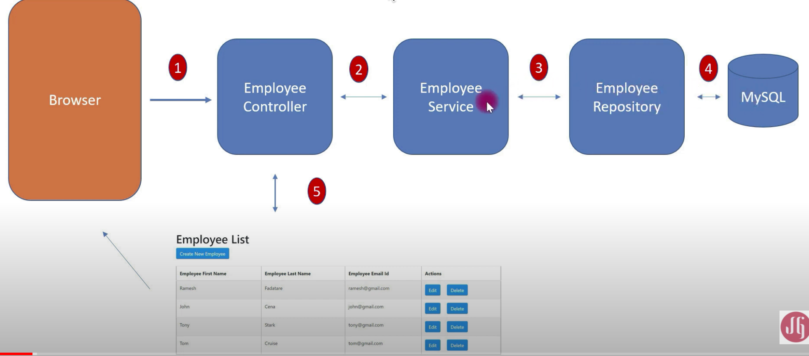
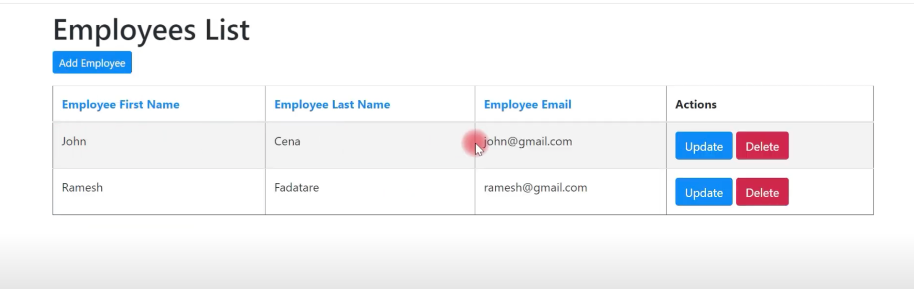
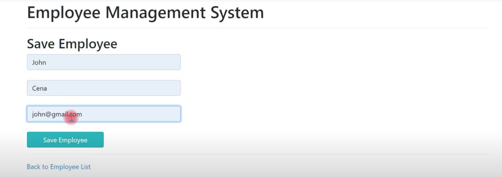

# Employee Management System

This project creates a web application for Employee Management System.

`The main functionalities demonstrated in this project are`:

Retrieve all Employees, Create a New Employee, Update an Employee, Delete an Employee

Implemented REST API's using Spring boot, Spring Data JPA, Hibernate, MySQL

Designed the front end using ThymeLeaf.

### Steps to Run the Project to IDE:

1. Clone and import the project.
2. Run the Application.java file
3. Application launches in localhost:8080

### Application Overview:

 Application design: 

 Main Page:  

Add Employee Page:  

